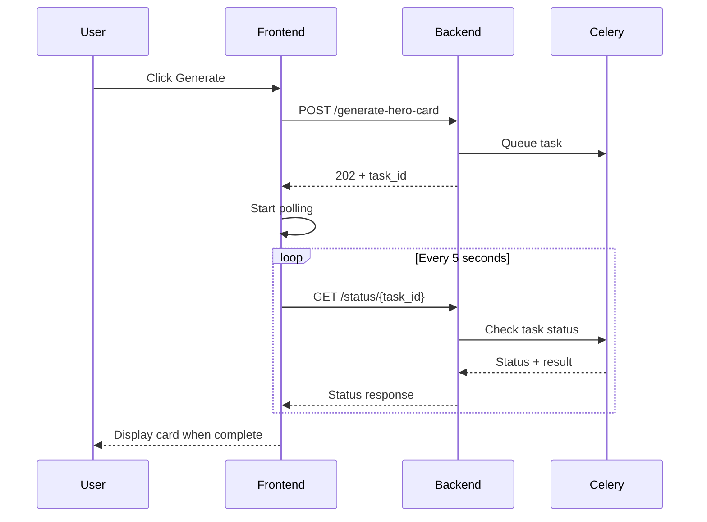

# Rails Superhero Cards

Get an AI-generated Rails superhero card from a set of skills and a photo.



## Local Setup

Key dependencies:

- Python 3.12
- FastAPI 0.124.2
- Node 22
- React 19
- Postgres 16
- Localstack

### With Taskfile

Download the [task runner](https://taskfile.dev/):

```shell
brew install go-task/tap/go-task
```

Copy `.env.example` and fill in your environment variables.

Run `task up:build` to build the Docker images and start the application.

Run `task migrate` to run migrations.

Navigate to `http://localhost:3003` to access the application.

To run the linter do `task lint`. Or for specific linters:

```shell
task lint:backend
task lint:frontend
```

Run `task` to see a list of all available tasks.

###  With Docker Compose

Copy `.env.example` and fill in your environment variables.

Run `docker-compose up -d` to start the application.

Run `docker-compose exec backend uv run alembic upgrade head` to run migrations.

Navigate to `http://localhost:3003` to access the application.

### Langfuse Setup

The app uses [Langfuse](https://langfuse.com) to trace LLM conversations. You can set up an account at https://cloud.langfuse.com.

By default, tracing is off. Set the `ENABLE_LANGFUSE` environment variable to `true` to enable it.
